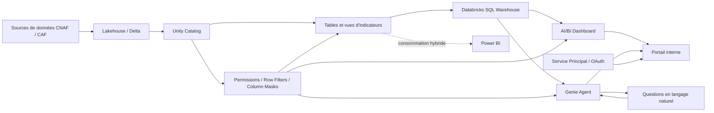

## Executive summary

Après avoir participé au **Databricks Data + AI World Tour**, je souhaitais confronter une partie du discours autour de la démocratisation de la donnée à un cas d'usage réel. La question était assez simple : **peut-on proposer à des utilisateurs métier une expérience analytique complète directement depuis Databricks, sans faire systématiquement de Power BI la dernière étape de la chaîne ?**

C'est dans ce cadre que j'ai réalisé un POC autour de **Databricks One, des AI/BI Dashboards et de Genie**, à partir d'un tableau de bord Power BI existant utilisé dans l'environnement CNAF et CAF. L'objectif n'était pas de faire une démonstration isolée. Il fallait repartir des données gouvernées dans le Lakehouse, reconstruire les indicateurs, reproduire le dashboard, gérer la cartographie des départements français et des DOM, permettre l'interrogation en langage naturel, puis intégrer le résultat dans un portail interne.

Le POC a permis de valider une chaîne de bout en bout :

**donnée gouvernée → indicateurs → SQL → dashboard → langage naturel → portail métier.**

Mon principal enseignement est cependant différent de celui que j'imaginais au départ : **le sujet le plus intéressant n'est pas de savoir si Databricks peut « remplacer Power BI », mais à quel endroit doit se situer la frontière entre plateforme Data + AI et outil de BI.**

C'est, à mon sens, l'angle le plus pertinent pour un data engineer.

Databricks positionne aujourd'hui AI/BI comme une couche analytique intégrée à la plateforme et Genie comme une interface permettant d'obtenir requêtes SQL, résultats et visualisations à partir du langage naturel. La nomenclature a d'ailleurs évolué : les *Genie Spaces* sont désormais appelés **Genie Agents**, tandis que **Genie One** vise l'expérience des utilisateurs métier.

## Partir de la donnée plutôt que du dashboard

Dans beaucoup d'architectures BI traditionnelles, la chaîne se termine par un modèle spécifique à l'outil de restitution. Dans ce POC, j'ai essayé de prendre le problème dans l'autre sens : **construire d'abord un socle d'indicateurs réutilisable, puis considérer le dashboard comme un consommateur parmi d'autres**.

C'est cohérent avec l'approche Lakehouse. Databricks définit celui-ci comme une architecture combinant les propriétés du data lake et du data warehouse, avec Delta Lake pour le stockage et Unity Catalog pour la gouvernance. Microsoft décrit également l'intérêt du Lakehouse comme la possibilité de servir BI, data engineering et ML à partir d'une même donnée gouvernée.

Dans le POC, j'ai donc créé sous **Unity Catalog une base d'indicateurs unique**, puis je l'ai enrichie avec les mesures nécessaires au dashboard. L'intérêt est important : la définition d'un indicateur ne vit plus exclusivement dans un fichier Power BI ou dans une mesure DAX. Elle peut être exposée sous forme de table, de vue, de requête SQL ou, à terme, de couche sémantique réutilisable.

L'architecture logique obtenue peut être représentée ainsi :



Unity Catalog est particulièrement intéressant dans cette architecture car il concentre permissions, audit, lignage et mécanismes de restriction tels que les filtres de lignes et masques de colonnes. La gouvernance se situe donc plus près de la donnée et peut être réutilisée par plusieurs consommateurs.

Pour un data engineer, c'est probablement **le vrai changement de perspective** apporté par le POC : construire une donnée destinée non plus à *un rapport*, mais à plusieurs modes de consommation.

## Reproduire Power BI : là où le POC devient intéressant

Pour éviter une comparaison abstraite, j'ai choisi de reproduire un **dashboard Power BI existant**. Ce choix a été utile car il impose immédiatement des contraintes que l'on ne rencontre pas dans une démonstration produit.

Il fallait notamment retrouver les KPI, filtres, agrégations et surtout une **carte de France représentant les CAF et leurs indicateurs par département, sans oublier les départements d'outre-mer**.

Les AI/BI Dashboards permettent aujourd'hui de construire leurs datasets à partir de tables, de vues ou de requêtes SQL, puis d'y ajouter graphiques, tables, filtres et interactions. Les versions actuelles proposent également les choroplèthes et les *point maps*.

La cartographie reste néanmoins un excellent test de maturité. Une carte métier française ne se résume pas à placer quelques points sur une carte mondiale : il faut gérer correctement les codes départementaux, les départements 2A/2B, les codes ultramarins, les éventuelles géométries et l'indicateur rattaché à chaque territoire.

**Hypothèse à adapter à l'implémentation exacte du POC :** lorsque le fond cartographique disponible ne correspond pas exactement au découpage attendu, une stratégie pragmatique consiste à enrichir le référentiel départemental avec une latitude et une longitude représentatives et à construire une *point map*. Pour une version de production, la documentation Databricks actuelle permet aussi de travailler avec des données `GEOMETRY`/`GEOGRAPHY` ou des régions administratives telles que NUTS, ce qui ouvre la voie à un véritable choroplèthe personnalisé.

Cette partie du POC illustre une différence importante avec Power BI : **Power BI reste aujourd'hui plus confortable lorsque l'objectif principal est la richesse de restitution et le design très poussé d'un rapport**. Microsoft positionne toujours Power BI comme sa plateforme de BI self-service et d'entreprise, avec des rapports interactifs et un écosystème étroitement intégré à Microsoft 365.

Databricks m'a semblé plus naturel lorsque le dashboard constitue la continuité d'un produit de donnée déjà construit dans la plateforme.

### Exemple de dataset préparé pour le dashboard

```sql
SELECT
    code_departement,
    libelle_departement,
    code_caf,
    periode,
    nb_allocataires,
    montant_prestations,
    montant_prestations / NULLIF(nb_allocataires, 0)
        AS montant_moyen_par_allocataire
FROM cnf.production.indicateurs_caf
WHERE periode = :periode;
```

L'idée est volontairement simple : **faire porter au socle de données une logique métier explicite**, plutôt que recréer la même règle indépendamment dans chaque outil de restitution.

## Genie : le langage naturel ne dispense pas du data engineering

La partie la plus intéressante du POC a probablement été la configuration de la **Genie room**, aujourd'hui appelée Genie Agent dans la documentation Databricks.

Un Genie Agent n'est pas simplement un LLM auquel on donne accès à une base de données. Databricks permet de lui fournir les tables Unity Catalog autorisées, des descriptions, des relations de jointure, des règles métier, des synonymes, des exemples de SQL et des questions représentatives. Les exemples SQL servent notamment à guider Genie vers la bonne logique pour les formulations proches rencontrées ensuite.

C'est un point essentiel : **la qualité d'un assistant analytique dépend énormément de la qualité de la couche sémantique qu'on lui fournit.**

Quelques questions représentatives du POC pourraient être :

> « Quelles sont les cinq CAF ayant la plus forte valeur de l'indicateur ce mois-ci ? »

> « Compare cet indicateur entre la métropole et les départements d'outre-mer. »

> « Quelle est son évolution sur les douze derniers mois pour le département 974 ? »

> « Quels départements ont progressé de plus de 10 % par rapport au mois précédent ? »

Pour la dernière question, le SQL produit peut par exemple se rapprocher de :

```sql
WITH evolution AS (
    SELECT
        code_departement,
        periode,
        valeur,
        LAG(valeur) OVER (
            PARTITION BY code_departement
            ORDER BY periode
        ) AS valeur_precedente
    FROM cnf.production.indicateurs_caf
)
SELECT
    code_departement,
    valeur,
    ROUND(
        100 * (valeur - valeur_precedente)
        / NULLIF(valeur_precedente, 0), 2
    ) AS evolution_pct
FROM evolution
WHERE periode = :periode
  AND valeur > valeur_precedente * 1.10
ORDER BY evolution_pct DESC;
```

**Ce SQL est un exemple pédagogique représentatif, pas la transcription d'une requête réelle du POC.**

Le vrai travail du data engineer commence alors avant le prompt : noms de colonnes compréhensibles, granularité maîtrisée, définitions d'indicateurs non ambiguës, relations fiables et jeu de données suffisamment restreint.

Databricks recommande explicitement d'ajouter exemples SQL, instructions et *knowledge store* pour améliorer la qualité des réponses. La plateforme permet également d'afficher le SQL généré, ce qui est précieux pour tester et auditer les réponses.

Cela change ma lecture du « chat with your data » : **le langage naturel ne remplace pas la modélisation. Il la rend encore plus importante.**

## Sécurité, embedding et coût : les vrais sujets de production

Le dernier objectif était d'intégrer le dashboard dans un **portail interne**, avec une identité technique de type **service principal**.

Databricks permet aujourd'hui d'embarquer des dashboards dans une application. Pour les scénarios d'*external embedding*, une application peut s'authentifier via service principal et OAuth afin que l'utilisateur n'ait pas nécessairement à disposer lui-même d'un compte Databricks. La documentation recommande de limiter au strict nécessaire les droits accordés au principal de service.

Une subtilité mérite cependant d'être soulignée pour une industrialisation : **l'Ask Genie intégré au dashboard n'est actuellement pas pris en charge dans le mode d'external embedding**. Databricks recommande dans ce cas d'utiliser la **Genie Conversation API** pour intégrer la conversation dans l'application.

C'est typiquement le genre de différence qu'un POC permet de mettre au jour.

Sur la sécurité, je privilégierais une règle simple : **ne jamais considérer le service principal comme le mécanisme de RLS.** La restriction doit être portée au plus près de la donnée par Unity Catalog, via vues sécurisées, *row filters*, *column masks* ou politiques appropriées. Genie applique les permissions Unity Catalog de l'utilisateur dans son modèle d'accès standard.

Power BI possède lui aussi une RLS mature, définie par rôles et expressions de filtrage. Dans un scénario embedded avec service principal, Microsoft précise toutefois que l'identité du service principal ne suffit pas à identifier l'utilisateur final : la RLS par utilisateur nécessite alors de transmettre une `EffectiveIdentity` lors de la génération du token.

### Comparaison issue du POC

| Critère | Databricks AI/BI + Genie | Power BI |
|---|---|---|
| **Visualisation** | Suffisante pour de nombreux dashboards opérationnels, en progression rapide | Plus mature pour les rapports très travaillés |
| **UX métier** | Très intéressante grâce à dashboard + langage naturel | Très connue et très riche pour l'exploration visuelle |
| **Sémantique** | Très proche du Lakehouse, SQL, Unity Catalog et désormais des objets sémantiques Databricks | Modèle sémantique Power BI très mature |
| **Gouvernance** | Point fort : contrôle au niveau de la plateforme et de la donnée | RLS robuste, avec gouvernance également possible dans Fabric/Purview |
| **GenAI** | Genie directement orienté interrogation de la donnée gouvernée | Écosystème Power BI/Fabric enrichi par les capacités IA Microsoft |
| **Embedding** | Dashboard externe possible via service principal/OAuth | Power BI Embedded très mature et prévu pour ce scénario |
| **Coût** | Principalement consommation du SQL Warehouse, calcul et usages associés | Licences utilisateur ou capacité Fabric/Embedded selon l'architecture |
| **Meilleur usage** | Analytics proche de la plateforme Data + AI | BI d'entreprise et reporting riche |

La comparaison de coûts doit rester qualitative tant que l'on ne dispose pas des métriques du POC. Databricks fonctionne largement sur une logique de consommation de compute, alors que Power BI combine licences utilisateur et capacités selon les scénarios. Power BI Embedded est lui aussi facturé comme un service à l'usage.

Côté Databricks, il faut aussi prendre en compte le cache. Les AI/BI Dashboards mettent en cache les résultats de requêtes afin de réduire le temps de chargement et le recours au SQL Warehouse. La documentation mentionne notamment un cache de résultats pouvant être réutilisé pendant plusieurs heures, ce qui rend indispensable de définir explicitement les exigences de fraîcheur des données.

En production, je mesurerais donc au minimum **temps de chargement à froid et à chaud, nombre de requêtes par consultation, consommation SQL Warehouse, concurrence utilisateur, taux de réponses Genie correctes et coût par utilisateur actif** avant toute comparaison financière sérieuse.

## Remplacer Power BI ? Je poserais autrement la question

À l'issue du POC, je ne présenterais pas Databricks comme un « Power BI killer ». Cette conclusion serait à la fois trop simple et peu intéressante techniquement.

Je poserais plutôt la question suivante :

> **Quels usages doivent réellement sortir du Lakehouse pour être reconstruits dans une plateforme BI séparée ?**

C'est là que le POC devient stratégique.

Pour un dashboard proche de la donnée, utilisé pour piloter des indicateurs déjà présents dans Databricks et nécessitant de l'exploration conversationnelle, **AI/BI + Genie peut réduire le nombre de couches techniques**. Pour un rapport institutionnel très travaillé, bénéficiant d'un important patrimoine DAX, d'une UX spécifique ou d'un écosystème Microsoft déjà largement déployé, **Power BI conserve de sérieux avantages**. Les deux produits ne sont donc pas obligés de s'exclure. Microsoft et Databricks documentent d'ailleurs l'interopérabilité entre Databricks et Power BI, ce qui rend une architecture hybride parfaitement légitime.

Ma roadmap de production serait ainsi progressive :

1. **Stabiliser la couche d'indicateurs dans Unity Catalog**, avec définitions, propriétaire, granularité, qualité et règles de sécurité.
2. **Benchmarker AI/BI sur quelques cas d'usage ciblés**, plutôt que migrer un catalogue Power BI complet.
3. **Industrialiser Genie** avec un jeu de questions de référence, des réponses attendues, des exemples SQL et une mesure régulière de précision. Databricks fournit aujourd'hui des fonctions de test et de monitoring des Genie Agents.
4. **Séparer authentification applicative et autorisation data**, notamment pour le portail embarqué.
5. **Mesurer les coûts réels** avec plusieurs profils de charge avant de conclure sur le TCO.
6. **Assumer une architecture hybride** lorsque Power BI reste meilleur pour la restitution, tout en faisant de Databricks le socle gouverné des indicateurs.

C'est finalement mon principal retour de cette expérimentation : **la convergence entre data engineering, BI et IA conversationnelle est bien réelle, mais elle ne supprime pas les responsabilités du data engineer. Elle les déplace.**

Le défi n'est plus seulement de construire un pipeline qui alimente un dashboard. Il faut construire **un produit de donnée suffisamment fiable, documenté, sécurisé et sémantiquement clair pour être consommé indifféremment par du SQL, un dashboard, Power BI, une API ou un agent conversationnel**.

Et c'est sans doute à cet endroit que Databricks One et Genie deviennent les plus intéressants : non pas parce qu'ils reproduisent Power BI, mais parce qu'ils interrogent la nécessité de séparer systématiquement la plateforme qui produit la donnée de celle qui permet aux métiers de la comprendre.
